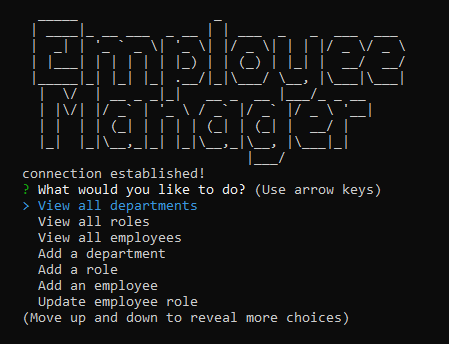

# My-Employee-Management-System

 

A console application Content Management Systems for managing a company's employees where it can view and manage the departments, roles, and employees.

## Installation

1. Download or clone repository
2. Node.js is required to run the application
3. `npm install` to install the required npm packages

## Usage

* To start using the application, use mySQL Workbench to setup the database and seed using files:

      * [scheme.sql](./db/schema.sql)
      * [seed.sql](./db/seed.sql)

* The application is invoked by running `node app.js` in the command line
* Follow the prompts to finish application

## Demo and Links

* [Video Demo](https://drive.google.com/file/d/1aEthJy32mQkgJQb6WPvvUp8xnub3h3DK/view?usp=sharing)
* [Github](https://github.com/jak3ster/my-employee-management-system)

## Features

* JavaScript
* Node.js
* MySQL
* npm packages
  * Inquirer
  * Figlet
  * mysql

## License

  Licensed under the [MIT](LICENSE) license.
